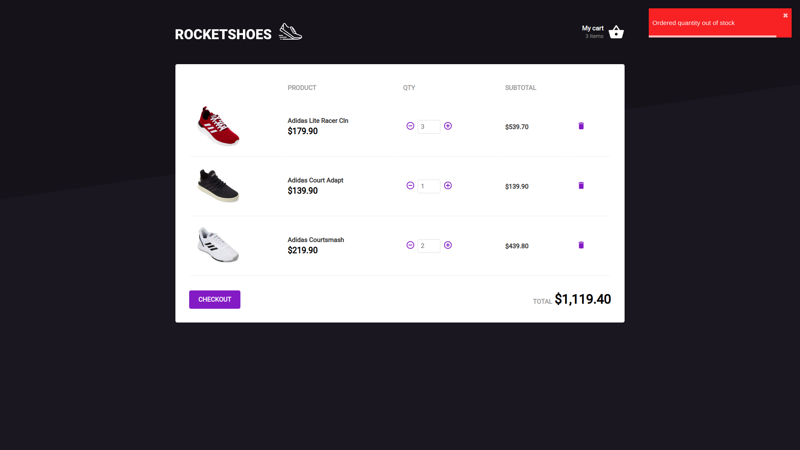

# RocketShoes

> A React App created on Rocketseat's 7th Bootcamp module to emulate an ecommerce

---

# :wrench: Stack

This project was created using [React](https://reactjs.org/) and [Styled Components](https://styled-components.com/).

# :construction_worker: Installation

**Once you have [Node.js](https://nodejs.org/en/download/) and [Yarn](https://yarnpkg.com/) installed, install the dependencies running:**

```bash
$ yarn
```

**Setup the API**

This project uses [JSON Server](https://github.com/typicode/json-server) to simulate an API.

To start the server, run:

```bash
$ yarn json-server server.json -p 3333
```

# :rocket: Running the app

After doing the previous steps, inside the cloned repo folder run:

```bash
$ yarn start
```

# :memo: License

This project is under the [MIT license](https://github.com/v1eira/Rocketshoes-Frontend/blob/master/LICENSE).

# :computer: Screens




# :iphone: Mobile

Click [here](https://github.com/v1eira/rocketshoes-mobile) to see the mobile version of this app.
