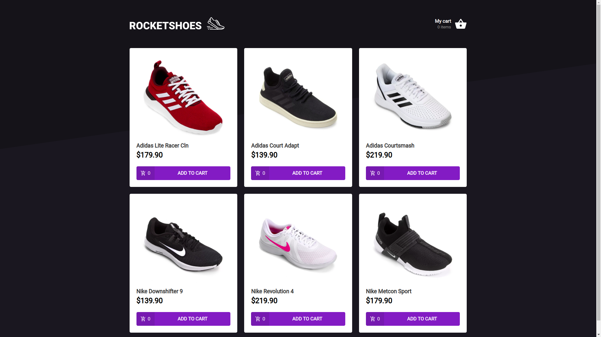

# Rocketshoes - Frontend
A React App created on Rocketseat's 7th Bootcamp module

## Environment
- OS: Ubuntu 18.04
- Text editor: VS Code 1.37.0

## Tools
- Axios
- ESLint
- Prettier
- JSON Server
- Styled Components
- Polished
- ReactJS
- Reactotron
- React Icons
- React Toastify
- Redux
- Redux Saga

## Running the app:
To start the JSON Server, run:
```bash
$ yarn json-server server.json -p 3333
```

Now start the application by running:
```bash
$ yarn start
```

## Screens



## Mobile
Click [here](https://github.com/v1eira/rocketshoes-mobile) to see the mobile version of this app.
